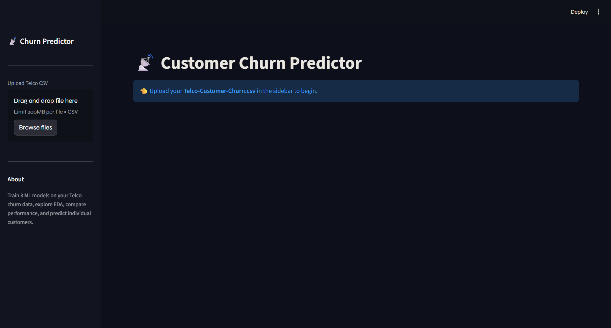
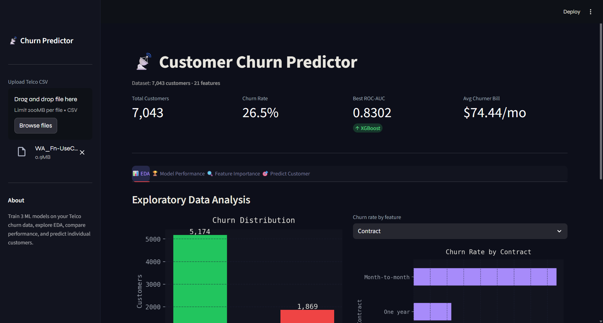

# 📡 Customer Churn Prediction Dashboard



## 🚀 Overview

An interactive machine learning dashboard that predicts customer churn using multiple models and provides deep insights through visual analytics.

## ✨ Features

* 📊 Exploratory Data Analysis (EDA)
* 🧠 Multiple ML Models:

  * Logistic Regression
  * Random Forest
  * XGBoost
* ⚖️ Handles imbalance using SMOTE
* 📈 ROC Curve & Confusion Matrix
* 🔍 Feature Importance Visualization
* 🎯 Real-time Customer Prediction (Streamlit UI)

## 🛠 Tech Stack

* Python
* Pandas, NumPy
* Scikit-learn
* XGBoost
* Streamlit
* Matplotlib, Seaborn

## 📂 Project Structure

app/ → Streamlit dashboard
src/ → Model training
models/ → Saved model files

## ▶️ Run Locally

```bash
pip install -r requirements.txt
streamlit run app/app.py
```

## 📊 Dataset

Telco Customer Churn Dataset (Kaggle)

## 🚀 Future Improvements

* Deploy on Streamlit Cloud
* Add API using FastAPI
* Improve model performance

## 👨‍💻 Author

Rohan Shantaram Nagpure
